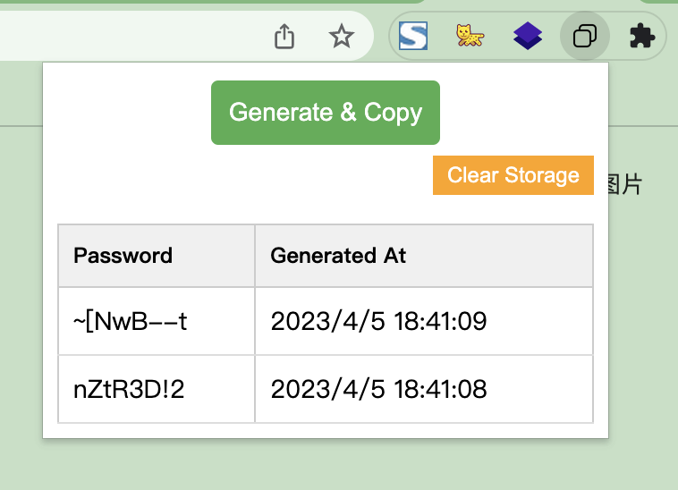

  

<h1 align="center">Randomkey</h1>

*Randomkey is a web browser extension to help generates a random password and stores it in a table.*

Note: The project code is generated from chatGPT. If anyone else uses this extension, I will optimize the code and add features.

### Installation Instructions
**Google Chrome**
1. Download this repo as a [ZIP file from GitHub](https://github.com/Marchccc/randomkey-chrome/archive/master.zip).
1. Unzip the file and you should have a folder named `Randomkey`.
1. In Chrome go to the extensions page (`chrome://extensions`).
1. Enable Developer Mode.
1. Drag the `Randomkey` folder anywhere on the page to import it (do not delete the folder afterwards).

### Disclaimer
* This software is provided for educational purposes only and
is provided "AS IS", without warranty of any kind, express or
implied, including but not limited to the warranties of merchantability,
fitness for a particular purpose and noninfringement. in no event shall the
authors or copyright holders be liable for any claim, damages or other
liability, whether in an action of contract, tort or otherwise, arising from,
out of or in connection with the software or the use or other dealings in the
software.
